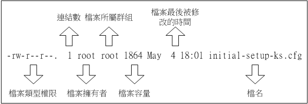
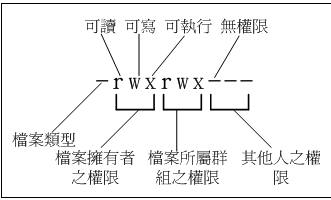

#### 檔案屬性
- 檔案類型與權限  
    
    
- chgrp: 改變檔案所屬群組  
  ```
  chgrp [-R(遞迴)] 群組名 要修改的目錄或檔案
  ```
- chown: 改變檔案擁有者  
  ```
  chown [-R] 帳號名稱 檔案或目錄
  chown [-R] 帳號名稱:群組名稱 檔案或目錄
  ```
- chmod: 改變檔案的權限  
  - r:4、w:、x:1  
    ```
    chmod [-R] xyz 檔案或目錄
    xyz -> 表示數字
    ```
  - chmod ugoa(u:user g:group o: other a:all)(+-=)(r w x) 檔案或目錄  
    ```
    chmod u=rwx,go=rx xxx
    chmod a+w xxx
    ```