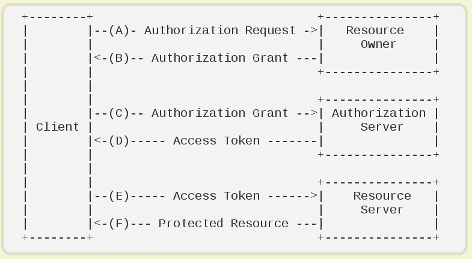

#### OAuth
- ``http://www.ruanyifeng.com/blog/2014/05/oauth_2_0.html``
- Third-party application: 第三方應用程序，可看為client端
- HTTP service: 服務提供商
- Resource Owner: 資源擁有者，可以看為user
- User Agent: 用戶代理，如瀏覽器
- Authorization server: 認證服務器，服務提供商提供專門處理認證的服務器
- Resource server: 服務提供商存放用戶資源的服務器，與認證服務器可以分開也可以是同一台服務器

#### 運行過程
  
估見技術在B的過程，用戶該如何授權給客戶端。

#### 授權模式
- 授權碼模式
- 簡化模式
- 密碼模式
- 客戶端模式